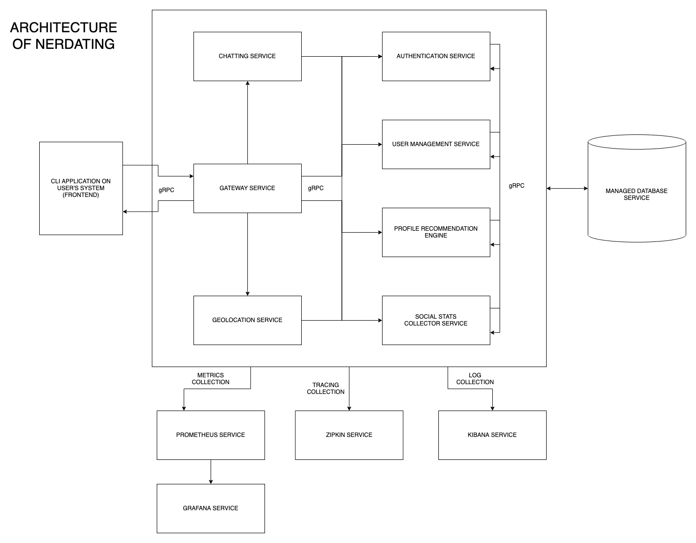

# Nerdate
A command line dating application for nerds. This application will run via a CLI and will help software engineers to date a nerd with similar skillset, career objective or social presence. This is purely CLI application, so there wont be any UI like a website or an app. It will run either on laptop or mobile devices via CLI only. The final build will support a wide variety of CPU architectures. Users won't be able to see each other via a photo, but they can definitely view each other's github profiles, linkedin profiles, current company, job roles etc.

# Repository index
Below is the repo index of all services present for this application:
| Service name | Repository link | Service description |
| ------ | ------ | ----- |

# Important repositories
Below are some important repositories of products we will use:
| Name | URL | Description |
| ------ | ------ | ------ |
| gRPC Gateway | https://github.com/grpc-ecosystem/grpc-gateway | Helps exposing APIs in both gRPC and Rest |

# Architecture

## Technologies
This application is having a microservice architecture. The technologies used are as below:
1. gRPC - for inter process communication.
1. Go - for service and CLI development.
1. Java - for service development.
1. mTLS - for inter service authentication.
1. MySQL or MongoDB - for data storage (Not finalized).
1. Kibana - for log collection.
1. Docker - for packaging of all services.
1. Zipkin - for request tracing.
1. Prometheus - for metrics collection.
1. Grafana - for displaying dashboards.
1. Websockets - for chatting.

## Design
Below is the design of the service

